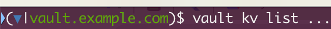

vault-ps1: Vault prompt for bash and zsh
============================================
Inspired by [kube-ps1](https://github.com/jonmosco/kube-ps1).

A script that lets you add the current VAULT_ADDR to your Bash/Zsh prompt strings (i.e. the `$PS1`).



## Installing

### From Source

1. Clone this repository
2. Source the vault-ps1.plugin.zsh in your `~/.zshrc` or your `~/.bashrc`

#### Zsh
```sh
source /path/to/vault-ps1.plugin.zsh
PROMPT='$(vault_ps1)'$PROMPT
```
#### Bash
WARNING: This has not been tested for bash shells yet.
```sh
source /path/to/vault-ps1.plugin.zsh
PS1='[\u@\h \W $(vault_ps1)]\$ '
```

## Enabling/Disabling

If you want to stop showing vault address on your prompt string temporarily
run `vaultoff`. To disable the prompt for all shell sessions, run `vaultoff -g`.
You can enable it again in the current shell by running `vaulteon`, and globally
with `vaulton -g`.

```
vaulton     : turn on vault-ps1 status for this shell.  Takes precedence over
             global setting for current session
vaulton -g  : turn on vault-ps1 status globally
vaultoff    : turn off vault-ps1 status for this shell. Takes precedence over
             global setting for current session
vaultoff -g : turn off vault-ps1 status globally
```

## Customization

The default settings can be overridden in `~/.bashrc` or `~/.zshrc` by setting
the following environment variables:

| Variable | Default | Meaning |
| :------- | :-----: | ------- |
| `VAULT_PS1_PREFIX` | `(` | Prompt opening character  |
| `VAULT_PS1_SYMBOL_ENABLE` | `true ` | Display the prompt Symbol. If set to `false`. |
| `VAULT_PS1_SYMBOL_PADDING` | `false` | Adds a space (padding) after the symbol to prevent clobbering prompt characters |
| `VAULT_PS1_SYMBOL_DEFAULT` | `▼ ` | Default prompt symbol. Unicode `\u25bc` |
| `VAULT_PS1_SUFFIX` | `)` | Prompt closing character |

For terminals that do not support UTF-8, the symbol will be replaced with the
string `vault`.

## Colors

The default colors are set with the following environment variables:

| Variable | Default | Meaning |
| :------- | :-----: | ------- |
| `VAULT_PS1_PREFIX_COLOR` | `null` | Set default color of the prompt prefix |
| `VAULT_PS1_SYMBOL_COLOR` | `blue` | Set default color of the Vault symbol |
| `VAULT_PS1_SUFFIX_COLOR` | `null` | Set default color of the prompt suffix |
| `VAULT_PS1_BG_COLOR` | `null` | Set default color of the prompt background |

Set the variable to an empty string if you do not want color for each
prompt section:

Names are usable for the following colors:

```
black, red, green, yellow, blue, magenta, cyan
```

256 colors are available by specifying the numerical value as the variable
argument.
